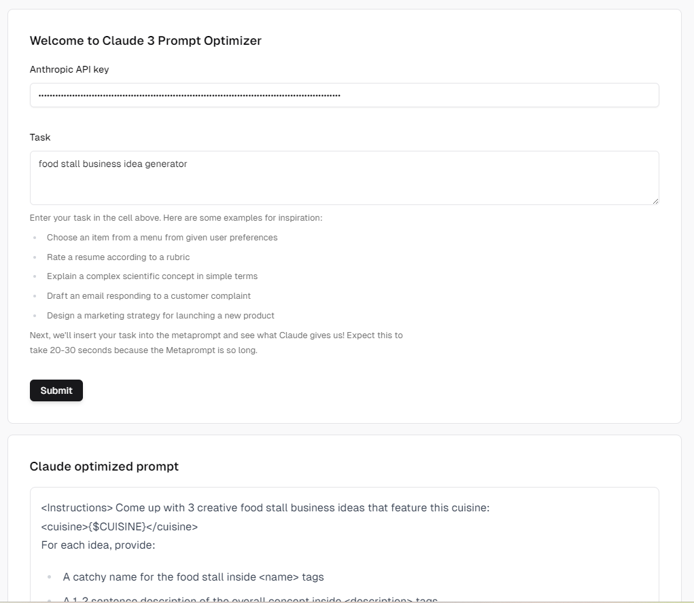

<h1 align="center">Claude 3 Helper metaprompt (experimental)</h1>

<p align="center">
  An open-source Claude 3 prompt optimizer using the notebook from 
  <a href="https://docs.anthropic.com/claude/docs/helper-metaprompt-experimental">
  Claude Docs
</a>

Try at https://claude-prompt-optimizer.vercel.app/




</p>

<br/>

## Features

-   For a given task, generate the optimized Claude prompt versions.

## Running locally

```bash
pnpm install
pnpm dev
```

Your app template should now be running on [localhost:3000](http://localhost:3000/).
